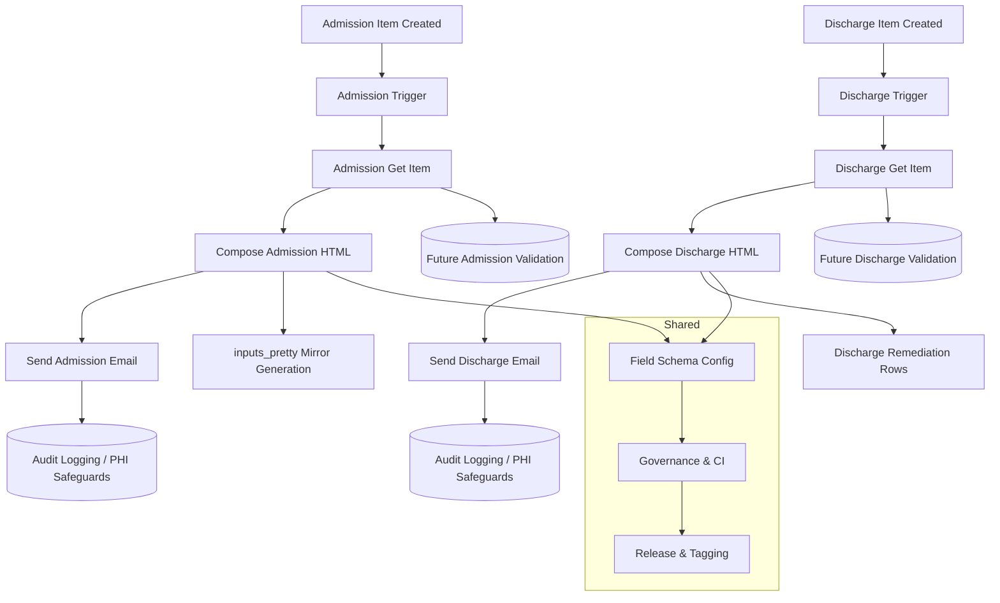

# HBPC Admission & Discharge Flows Architecture

<!-- TOC:START -->
1. Architecture Diagram
2. Components
3. Data Flow Highlights
4. Extension Points
<!-- TOC:END -->

## Components
| Step | Description | Notes |
|------|-------------|-------|
| Trigger | SharePoint list item created/modified | Source of initial context |
| Get Item | Retrieves full field payload | Normalized access path `outputs('Get_item')` |
| Compose (Admission) | Builds Admission HTML with unified fallback pattern | Central reconstruction target (mid-body restoration) |
| Compose (Discharge) | Builds Discharge HTML with remediated summary rows | Recent remediation (v0.5.0) |
| Send Email | Delivers clinical summary | Contains rendered HTML |
| inputs_pretty | Readability aid (non-executed) | Regenerated via script |
| Export Zips | Environment snapshot for rollback | Stored under `tests/flowSuccess/` & `tests/flowFailure/` |

## Data Flow Highlights
- Choice field resolution standardized with `/Value` to surface label text.
- Fallback text `Not provided` ensures visibility of absent data.
- Future validation hook can parse run output JSON to confirm field conformity before send.

## Extension Points
| Future Component | Purpose |
|------------------|---------|
| Validation Script | Pre-send verification of required fields & PHI masking |
| Expression Audit CI | Fallback + structure enforcement |
| Anonymization Tool | Redact PHI for troubleshooting outside secure boundary |

_Last updated: 2025-11-18_
